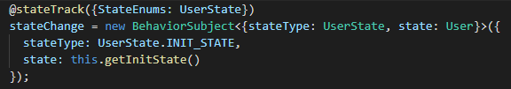

# AngularDecorator

[Decorator Code](src/app/decorators/state-track.ts)

It is a property decorator in order to log automatically the BehaviorSubject object changes.

BehaviorSubject structure

`BehaviorSubject<{stateType: any, state: any}>`

You are going to see your developer tools

You can integrate it with redux devtools https://chrome.google.com/webstore/detail/redux-devtools/lmhkpmbekcpmknklioeibfkpmmfibljd?hl=en

> **Note**:  it is only for visualization, NO change you do here will impact on the BehaviorSubject property

# Configurations

- **mode**
  - auto: (default) it is going to track the state automatically meanwhile the isProduction option is false
  - enable: it is always going to track the state automatically
  - disabled: it is never going to track the state
- **StateEnums**: the possible state types
- **isProduction**: (default: Angular's production environment variable) it is to indicate if it is running on production mode.

This project was generated with [Angular CLI](https://github.com/angular/angular-cli) version 8.3.21.

## Development server

Run `ng serve` for a dev server. Navigate to `http://localhost:4200/`. The app will automatically reload if you change any of the source files.

## Code scaffolding

Run `ng generate component component-name` to generate a new component. You can also use `ng generate directive|pipe|service|class|guard|interface|enum|module`.

## Build

Run `ng build` to build the project. The build artifacts will be stored in the `dist/` directory. Use the `--prod` flag for a production build.

## Running unit tests

Run `ng test` to execute the unit tests via [Karma](https://karma-runner.github.io).

## Running end-to-end tests

Run `ng e2e` to execute the end-to-end tests via [Protractor](http://www.protractortest.org/).

## Further help

To get more help on the Angular CLI use `ng help` or go check out the [Angular CLI README](https://github.com/angular/angular-cli/blob/master/README.md).
